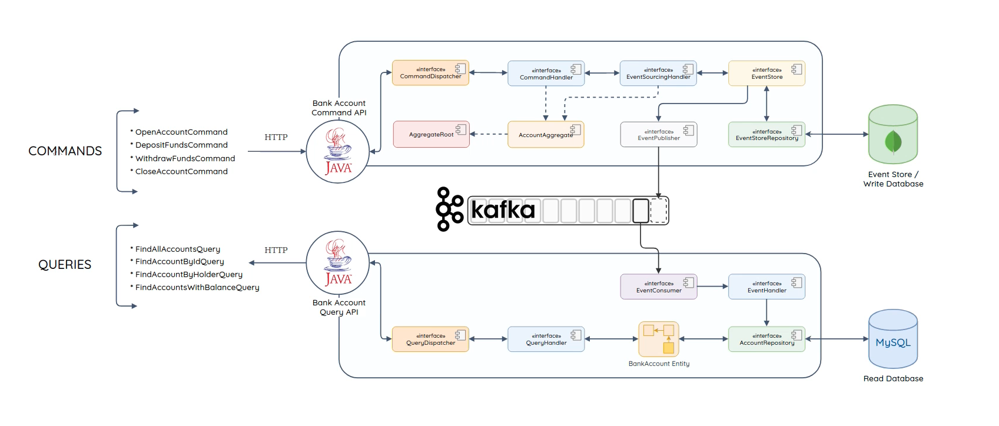

### What is CQRS?
CQRS stands for Command and Query Responsibility Segregation, a pattern that separates read and update operations for 
a data store. Commands alter the state of an object or entity, and queries return the state of an object or entity.
Implementing CQRS in your application can maximize its performance, scalability, and security. 
The flexibility created by migrating to CQRS allows a system to better evolve over time and prevents update commands 
from causing merge conflicts at the domain level.

### What is Event Sourcing?
Event Sourcing defines an approach where all the changes that are made to an object or entity, are stored as a sequence
of immutable events to an event store, as opposed to storing just the current state. So it is a pattern for storing data
as events in an append-only log. Every change made is represented as an event, and appended to the event log. An entity’s
current state can be created by replaying all the events in order of occurrence. The system information is sourced from
the events. As the event has already happened, it’s always referred to in the past tense (with a past-participle verb,
such as AccountClosedEvent).

### CQRS - Event Sourcing - Domain Driven Design Demo Project with Spring Boot, Kafka, MongoDB and MySQL
Sample bank account project that aims to use CQRS notion to segregate
* handling commands, namely, OpenAccountCommand, DepositFundsCommand, WithdrawFundsCommand, CloseAccountCommand and RestoreReadDbCommand
* handling queries, namely, FindAllAccountsQuery, FindAccountByIdQuery, FindAccountByHolderQuery and FindAccountWithBalanceQuery

### Preconditions
* Java 17+ should be installed at your local machine (Spring Boot 3.0 requires it).
* Docker and docker-compose are also needed.

### Running the containers
1. Navigate to ```cqrs-demo/local-env``` folder using the terminal.
2. Run ```docker-compose up -d``` command to have MySQL, MongoDB and Kafka containers at your local machine.

### Project Module Structure
1. <b>cqrs-es</b> Module
   - <b>cqrs.core</b> -> The core project. There is no main (Application) class since it is a pure library project.
2. <b>bank-account</b> Module (Parent project)
   - <b>account.cmd</b> -> Command project.
        - <b>api</b> package -> Contains commands, rest controllers and DTOs. 
        - <b>domain</b> package -> Contains account aggregate and event store repository.
        - <b>infrastructure</b> package -> Contains infrastructure related code such as command dispatcher, event producer, event sourcing handler as well as event store implementation.
   - <b>account.common</b> -> Account specific DTOs and event classes are stored. There is no main class since it is a pure library project.
   - <b>account.query</b> -> Query project.
       - <b>api</b> package -> Contains queries, rest controllers and DTOs.
       - <b>domain</b> package -> Contains account repository and bank account domain entity.
       - <b>infrastructure</b> package -> Contains consumer implementation, event handlers and query dispatcher.
3. <b>local-env</b> Module
    - It consists the docker-compose file for local setup and Postman collection for testing.


### Test
1. Go to the folder ```cqrs-demo/bank-account```
2. Run ```./mvnw clean install``` (For Linux and MacOS) command. It will build all the projects, namely,
```cqrs.core```
```account.common```
```account.cmd```
```account.query``` and
```bank-account```
3. Then the main classes of ```account.cmd``` (CommandApplication.java) and ```account.query``` (QueryApplication.java) projects should be run using IntelliJ or VSCode.
Alternatively, you can also run account.cmd and account.query projects from the terminal:
   - For the Command project go to the folder ```cqrs-demo/bank-account/account.cmd``` and run ```./mvnw spring-boot:run``` (For Linux and MacOS)
   - For the Query project go to the folder ```cqrs-demo/bank-account/account.query``` and run ```./mvnw spring-boot:run``` (For Linux and MacOS)

---
 - A sample Postman collection was shared in local-env folder  to test the commands and queries using REST APIs.
 - You can connect to MongoDB for command database and connect to MySQL for the queries.
 - *Replay Events* functionality can also be tested by using *Restore Read Database* request in sample Postman collection after deleting the bank_account table in MySQL.


### Architectural Overview



### Resources
1. https://www.udemy.com/course/java-microservices-cqrs-event-sourcing-with-kafka/
2. https://learn.microsoft.com/en-us/azure/architecture/patterns/cqrs
3. https://learn.microsoft.com/en-us/dotnet/architecture/microservices/microservice-ddd-cqrs-patterns/ddd-oriented-microservice